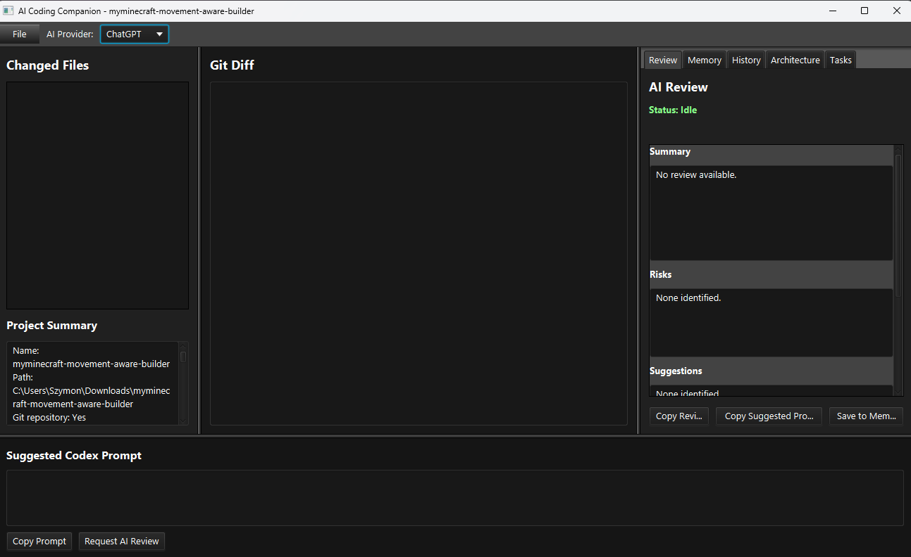

\# AI Coding Companion

AI Coding Companion is a desktop application that automatically reviews your code while you work.

\## Features

\- 🤖 Automatic AI code reviews

\- 📂 Git integration

\- 🧠 Persistent project memory

\- 🏗 Architecture explorer

\- 📝 Task planner

\- 📚 Review history

\- 💡 Suggested Codex prompts

\- ⚡ Automatic review pipeline

\- 🔌 Multiple AI providers

\- 🎨 JavaFX desktop interface

\## Tech Stack

\- Java 21

\- JavaFX

\- Gradle

\- Git

\- OpenAI Responses API

\## Screenshot

Roadmap

\- \[x] Git Integration

\- \[x] Project Analyzer

\- \[x] Architecture Explorer

\- \[x] Prompt Engine

\- \[x] Persistent Memory

\- \[x] Review History

\- \[x] Task Planner

\- \[x] Automatic Reviews

\- \[ ] Markdown Rendering

\- \[ ] Rich Diff Viewer

\- \[ ] Ollama Integration

\- \[ ] Multi-Agent Reviews

\## License

MIT

